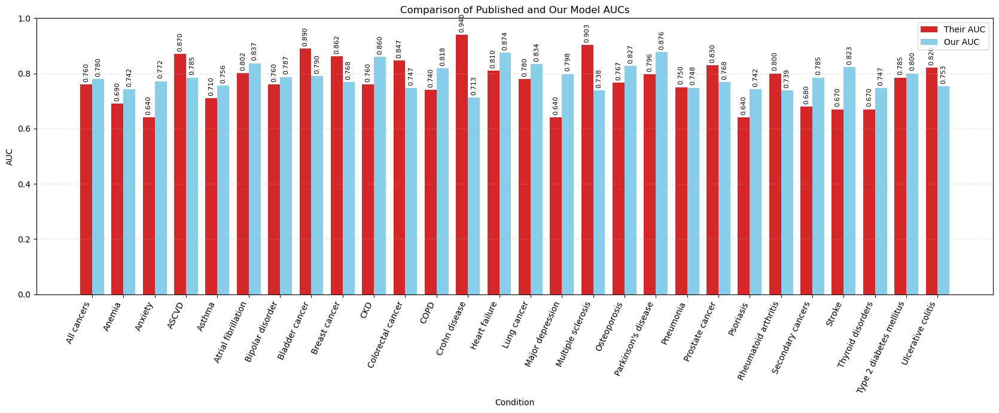
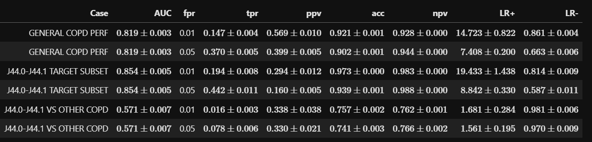
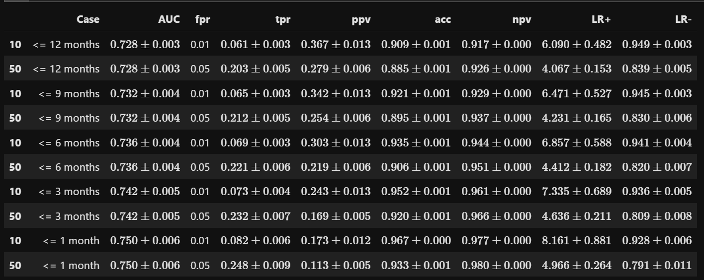
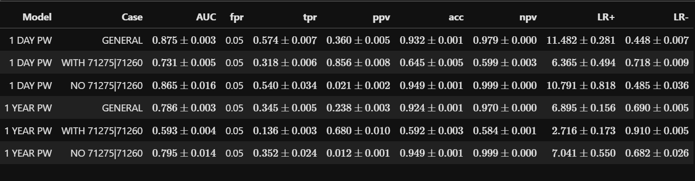

------------
------------
-------------

# <span style="color: #f9e800">CURRENT PROGRESS ::</span>

# Current progress on Nature-2026 model runs

### finishing this soon, progress stalled a bit as I need to move run byproducts to DGX as I hit disk quota

| Status | Condition | Age | Target | Their AUC | Our AUC |
|---|---|---:|---|---:|---:|
| ● Fully trained | Parkinson's disease | 50–85 | G20 | 0.796 | 0.87635 |
| ● Fully trained | Major depression | 20–65 | F32, F33 | ~0.640 | 0.798 |
| ● Fully trained | Stroke | 50–85 | I60–I64 | ~0.670 | 0.823 |
| ● Fully trained | Heart failure | 50–85 | I50 | ~0.810 | 0.874 |
| ● Fully trained | COPD | 50–85 | J41–J44 | ~0.740 | 0.818 |
| ● Fully trained | CKD | 40–75 | N18, I12, I13 | ~0.760 | 0.860 |
| ● Fully trained | Atrial fibrillation | 50–85 | I48 | ~0.802 | 0.837 |
| ● Fully trained | Osteoporosis | 50–85 | M80, M81 | 0.767 | 0.82691 |
| ● Fully trained | Prostate cancer | 50–85 | C61 | ~0.830 | 0.76812 |
| ● Fully trained | Psoriasis | 20–65 | L40 | ~0.640 | 0.742 |
| ● Fully trained | Thyroid disorders | 25–65 | E00–E07 | ~0.670 | 0.747 |
| ● Fully trained | Ulcerative colitis | 25–65 | K51 | ~0.820 | 0.753 |
| ● Fully trained | Crohn disease | 25–65 | K50 | ~0.940 | 0.713 |
| ● Fully trained | Type 2 diabetes mellitus | 30–70 | E11 | ~0.785 | 0.800 |
| ● Fully trained | Breast cancer | 35–75 | C50 | 0.862 | 0.768 |
| ● Fully trained | Asthma | 15–55 | J45 | 0.710 | 0.756 |
| ● Fully trained | Lung cancer | 50–85 | C34 | ~0.780 | 0.834 |
| ● Fully trained | Multiple sclerosis | 25–65 | G35 | ~0.903 | ~0.738 |
| ● Fully trained | Colorectal cancer | 40–80 | C18–C20 | ~0.847 | ~0.747 |
| ● Fully trained | Anxiety | 20–60 | F40–F41 | ~0.640 | 0.772 |
| ● Fully trained | Pneumonia | 25–65 | J12–J18, J69 | ~0.750 | 0.748 |
| ● Fully trained | Bipolar disorder | 20–60 | F31 | ~0.760 | 0.787 |
| ○ In progress | Bladder cancer | 50–85 | C67 | ~0.890 | ~0.790 |
| ● Fully trained | Anemia | 25–65 | D50–D64 | ~0.690 | 0.742 |
| ● Fully trained | Rheumatoid arthritis | 30–70 | M05–M06 | ~0.800 | 0.739 |
| ○ In progress | ASCVD | 50–85 | I20–I25, I63, I65, I66, I70, I73.9 | ~0.870 | ~0.785 |
| ○ In progress | All cancers | 50–85 | C | ~0.760 | ~0.780 |
| ○ In progress | Secondary cancers | 50–85 | C77–C7B | ~0.680 | ~0.785 |



# Cosmos Pulmonary prevalences
### **Cosmos SneakPeek numbers multiplied by 100**

### Adult disease prevalence, 2021–2026

| Geography | Active adult population | COPD cases | COPD prevalence | ILD cases | ILD prevalence | Lung cancer cases | Lung cancer prevalence |
|---|---:|---:|---:|---:|---:|---:|---:|
| Kentucky | 2,704,100 | 226,300 | 8.369% | 41,800 | 1.546% | 33,100 | 1.224% |
| United States | 174,594,900 | 8,664,400 | 4.963% | 2,024,800 | 1.160% | 1,319,400 | 0.756% |

### Lung cancer screening by year

| Geography | Year | Screening events | Patients screened |
|---|---:|---:|---:|
| Kentucky | 2021 | 38,200 | 20,000 |
| Kentucky | 2022 | 50,100 | 25,300 |
| Kentucky | 2023 | 62,300 | 31,500 |
| Kentucky | 2024 | 68,700 | 34,800 |
| Kentucky | 2025 | 72,400 | 35,700 |
| Kentucky | 2026 | 57,100 | 27,900 |
| United States | 2021 | 735,000 | 434,100 |
| United States | 2022 | 1,011,000 | 593,700 |
| United States | 2023 | 1,333,500 | 789,600 |
| United States | 2024 | 1,663,300 | 968,200 |
| United States | 2025 | 1,953,800 | 1,123,900 |
| United States | 2026 | 1,473,300 | 837,600 |

### Total lung cancer screening, 2021–2026

| Geography | Screening events | Unique patients screened |
|---|---:|---:|
| Kentucky | 348,800 | 85,600 |
| United States | 8,169,900 | 2,582,500 |


# Cosmos File Transfers:

* NHPF (IN, #1799) -- sent out files, waiting for loading, last email MON
* SISA (IN, #1694) -- sent out files, they seem to be reviewing the files, followed up TUE (responded, ETA end of week, duh)

# NHPF *_still_* stuck on lack of billing account for AoU

# COPD stuff



**For PROGRESSION model: J41-J44 --> J44.0/1 (in 1 day to 1 year):**

### <span style="color: #a9d11ad3"> => Perf for up to 1/3/6/9 months</span>



```
AUC: 0.72778
==
PREDICTIONS:
346579 (30117 POS, 316462 NEG)
Prevalence in Data: 8.69%
Males:
AUC: 72.7% (72.2%, 73.2%)
@ 95% Specificity:
Sensitivity: 20.2% (19.5%, 20.9%)
Positive LR: 4.04 (3.83, 4.26)
Negative LR: 0.84 (0.83, 0.85)
@ 99% Specificity:
Sensitivity: 5.8% (5.4%, 6.2%)
Positive LR: 5.78 (5.15, 6.49)
Negative LR: 0.95 (0.95, 0.96)
Females:
AUC: 72.8% (72.4%, 73.3%)
@ 95% Specificity:
Sensitivity: 20.6% (19.9%, 21.2%)
Positive LR: 4.11 (3.90, 4.33)
Negative LR: 0.84 (0.83, 0.84)
@ 99% Specificity:
Sensitivity: 6.4% (6.0%, 6.8%)
Positive LR: 6.41 (5.75, 7.14)
Negative LR: 0.95 (0.94, 0.95)
```


# Pulmonary Embolism Performance




------------
------------
-------------

## <span style="color: #64ca0a">What's up with ..?</span>

* **ADRD - Genomics - Colorado**

* Cosmos Machines

* UKHC Data Access


# <span style="color: #ff160a">TODO FOR THE NEXT MEETING ::</span>

* _**TORM latex writeup**_
-----


------------
------------
-------------
------------
-----------
------------
------------
-------------
------------
-----------
------------
------------
-------------
------------
-----------
------------
------------
-------------
------------
-----------
------------
------------
-------------
------------
-----------
# <span style="color: #76551c">Get to these at some point</span>


### Possible revisiting of ASD

From the recent (summer 2026) publication in JAMA (Dr. Gibbons is a co-author):

**Computerized Adaptive Tests for Rapid and Accurate Assessment of Autism:**

> ...Also, CAT-Autism may be used in conjunction with machine-learning advances in longitudinal risk
prediction models employing a zero-burden comorbidity risk (ZCoR) framework with electronic
health records (EHR).72 **As a complementary approach, when EHR data are available, ZCoR modeling
may provide initial risk stratifiers to identify individuals whose care plan could be informed by
CAT-Autism results. Furthermore, the adaptive tool may be incorporated into stepped-care services**
that assess symptom severity to determine level of intervention and monitor changing levels
over time...

_**Potential collaborator? Could re-launch the pediatric data and see what we get, especially with Total Odds Ratio Mapping**_

* **PEDIATRIC FIXED-AGE TORM MAPPING AND NEW ZEBRA MODEL**

