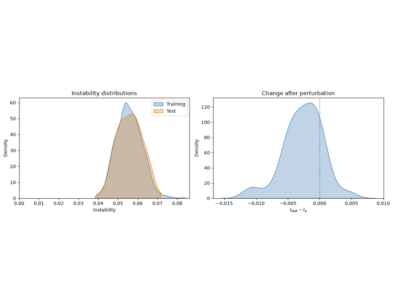

Sep 16, 2026 (Summaries from the week)

AJE paper is ready to submit.

Correlation matrix for a nonnumeric data?

Parsing the data 98% done in around 48 hours. 

  
   
  <em>Figure 1: Stability for the GSS 2018 dataset.</em>

