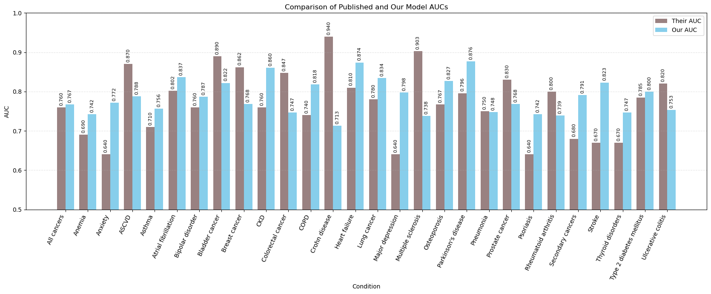
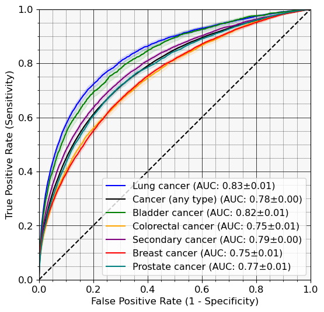

------------
------------
-------------

# CURRENT PROGRESS ::

# Current progress on Nature-2026 model runs

### finishing this soon, progress stalled a bit as I need to move run byproducts to DGX as I hit disk quota

| Status | Condition | Age | Target | Their AUC | Our AUC |
|---|---|---:|---|---:|---:|
| ● Fully trained | Parkinson's disease | 50–85 | G20 | 0.796 | 0.87635 |
| ● Fully trained | Major depression | 20–65 | F32, F33 | ~0.640 | 0.798 |
| ● Fully trained | Stroke | 50–85 | I60–I64 | ~0.670 | 0.823 |
| ● Fully trained | Heart failure | 50–85 | I50 | ~0.810 | 0.874 |
| ● Fully trained | COPD | 50–85 | J41–J44 | ~0.740 | 0.818 |
| ● Fully trained | CKD | 40–75 | N18, I12, I13 | ~0.760 | 0.860 |
| ● Fully trained | Atrial fibrillation | 50–85 | I48 | ~0.802 | 0.837 |
| ● Fully trained | Osteoporosis | 50–85 | M80, M81 | 0.767 | 0.82691 |
| ● Fully trained | Prostate cancer | 50–85 | C61 | ~0.830 | 0.76812 |
| ● Fully trained | Psoriasis | 20–65 | L40 | ~0.640 | 0.742 |
| ● Fully trained | Thyroid disorders | 25–65 | E00–E07 | ~0.670 | 0.747 |
| ● Fully trained | Ulcerative colitis | 25–65 | K51 | ~0.820 | 0.753 |
| ● Fully trained | Crohn disease | 25–65 | K50 | ~0.940 | 0.713 |
| ● Fully trained | Type 2 diabetes mellitus | 30–70 | E11 | ~0.785 | 0.800 |
| ● Fully trained | Breast cancer | 35–75 | C50 | 0.862 | 0.768 |
| ● Fully trained | Asthma | 15–55 | J45 | 0.710 | 0.756 |
| ● Fully trained | Lung cancer | 50–85 | C34 | ~0.780 | 0.834 |
| ● Fully trained | Multiple sclerosis | 25–65 | G35 | ~0.903 | ~0.738 |
| ● Fully trained | Colorectal cancer | 40–80 | C18–C20 | ~0.847 | ~0.747 |
| ● Fully trained | Anxiety | 20–60 | F40–F41 | ~0.640 | 0.772 |
| ● Fully trained | Pneumonia | 25–65 | J12–J18, J69 | ~0.750 | 0.748 |
| ● Fully trained | Bipolar disorder | 20–60 | F31 | ~0.760 | 0.787 |
| ● Fully trained| Bladder cancer | 50–85 | C67 | ~0.890 | 0.822 |
| ● Fully trained | Anemia | 25–65 | D50–D64 | ~0.690 | 0.742 |
| ● Fully trained | Rheumatoid arthritis | 30–70 | M05–M06 | ~0.800 | 0.739 |
| ● Fully trained | ASCVD | 50–85 | I20–I25, I63, I65, I66, I70, I73.9 | ~0.870 | 0.788 |
| ● Fully trained | All cancers | 50–85 | C | ~0.760 | 0.767 |
| ● Fully trained | Secondary cancers | 50–85 | C77–C7B | ~0.680 | 0.791 |

### Cancers' subset

# TODO FOR THE NEXT MEETING ::

* Refine the Pulmonary prevalences from COSMOS - prevals seem too low

* Complete at least minimal SISA survival analysis on Cosmos

* Do Nature-2026

* **Make a zcor package branch with the model installed as asset for Harinin to load onto AoU**

* _**TORM latex writeup**_

## What's up with ..?

* **ADRD - Genomics - Colorado**

* Cosmos Machines

* UKHC Data Access

------------
------------
-------------
------------
-----------
------------
------------
-------------
------------
-----------
------------
------------
-------------
------------
-----------
------------
------------
-------------
------------
-----------
------------
------------
-------------
------------
-----------
# Get to these at some point

### Possible revisiting of ASD

From the recent (summer 2026) publication in JAMA (Dr. Gibbons is a co-author):

**Computerized Adaptive Tests for Rapid and Accurate Assessment of Autism:**

> ...Also, CAT-Autism may be used in conjunction with machine-learning advances in longitudinal risk
prediction models employing a zero-burden comorbidity risk (ZCoR) framework with electronic
health records (EHR).72 **As a complementary approach, when EHR data are available, ZCoR modeling
may provide initial risk stratifiers to identify individuals whose care plan could be informed by
CAT-Autism results. Furthermore, the adaptive tool may be incorporated into stepped-care services**
that assess symptom severity to determine level of intervention and monitor changing levels
over time...

_**Potential collaborator? Could re-launch the pediatric data and see what we get, especially with Total Odds Ratio Mapping**_

* **PEDIATRIC FIXED-AGE TORM MAPPING AND NEW ZEBRA MODEL**

